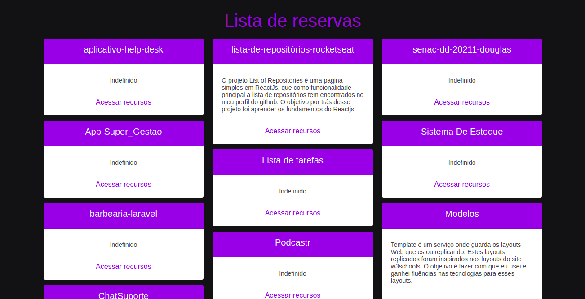
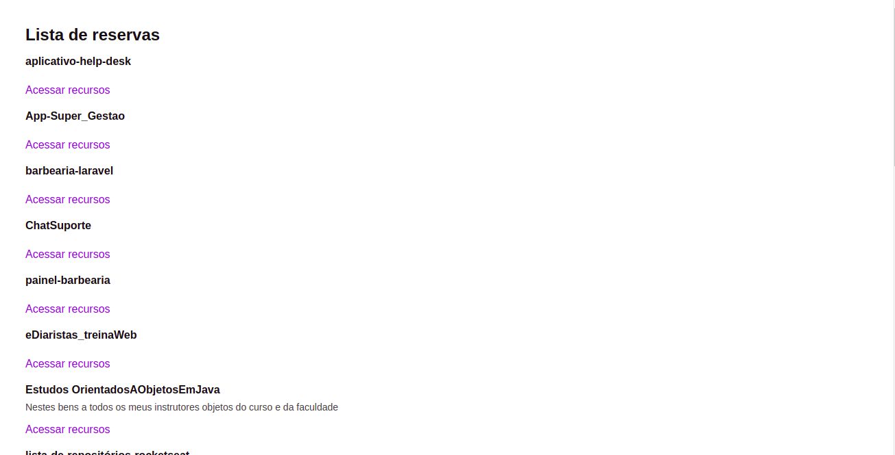

<h1 align="center">List of Repositories Rocketseat</h1>
<h2>&#x1F4DA; Sobre:</h2>

O projeto List of Repositories é uma pagina simples em ReactJs, que tem como funcionalidade principal listar os repositórios encontrados no meu perfil do github. O objetivo por trás desse projeto foi aprender os fundamentos de Reactjs.

 
<h2 align="center"> &#x1F6A7; List of Repositories concluido &#x1F6A7;</h2>
 
 <h2>✅ Demonstrações:</h2>

   

   
<h2>&#x1F6E0; Tecnologias:</h2>

As seguintes ferramentas foram usadas na construção do List of Repositories

<ul>
    <li><a href="https://pt-br.reactjs.org/">ReactJs</a></li>
    <li><a href="https://www.typescriptlang.org/">TypeScript</a></li>
    <li><a href="https://sass-lang.com/">SASS</a></li>
    <li><a href="https://getbootstrap.com/">Bootstrap</a></li>
</ul>
 
<h2>✅ Autor</h2>
<h3>Douglas Alisson</h3>

Feito com &#x1F9E1; por Douglas Alisson &#x1F44B; Entre em contato!

<ul>
    <li><a href="https://www.linkedin.com/in/douglas-alisson-da-silva-fredo-6593211a5/">Linkedin</a></li>
</ul>